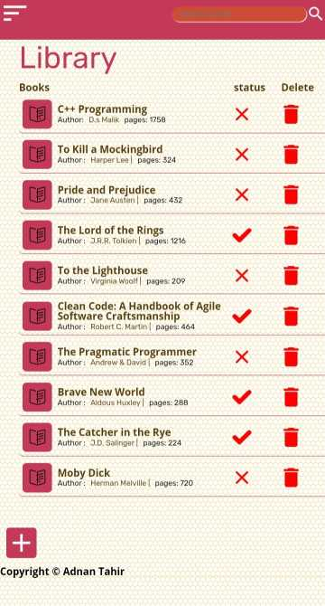
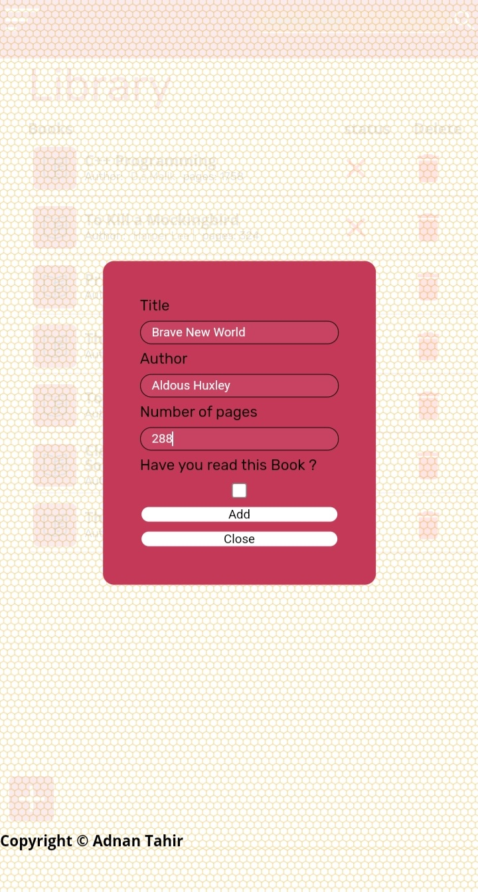
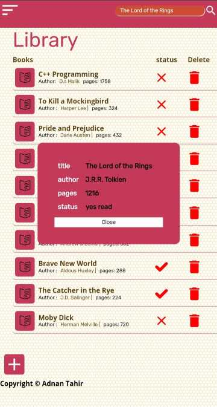

# Library

This project is a web-based library application that allows users to store and manage their book collection.
Users can enter book details, including the title, author, and reading status(read or not read ) and also have
the ability to delete books from the list. The project is built using HTML , CSS and javaScript.

## Live Demo 

check out the live demo of the library project on [Github Pages](https://adnantabda.github.io/Library/)

## Features 

- Add a book to the library by entering the title , author and reading status 
- Mark book as read or not read to keep track of you progress 
- Delete the book from the library if no longer needed 
- Responsive design to ensure a seamless experience across devices 

## Technologies Used 

The Library project is Developed using the following technologies: 

- HTML : used to structure the web pages and define the content 
- CSS  : employed for styling and layout of the application 
- JavaScript : implemented to provide interactivity and functionality 

## Usage 

1. Clone the repository to your local machine using the following command 
```

git clone https://github.com/adnantabda/Library.git

```

2. Open the project directory 

3. Launch the index.html file in your web browser 
4. Use the input fields to enter the book details including title, author , pages 
5. Click Add button to add the book to your library 
6. To mark as read or not read toggle the corresponding status Mark 
7. To delete a book from the library click the delete icon 
8. if you have a huge collection of books you can search a specific book using the input field at the top 
9. Explore the application and manage your book collection easily 

## screenshots 

<div style="display: grid ; grid-template-columns : 1fr 1fr 1fr  1fr  ; gap: 20px" >

<!--  -->

</div>

## Contributing 

Contributions to the library project are Welcome. if you encounter any bugs, have suggestions for improvements or would like to add new features, 
please feel free to submit a pull requests. Before contributing 

## License 

This project is licensed under MIT License 

